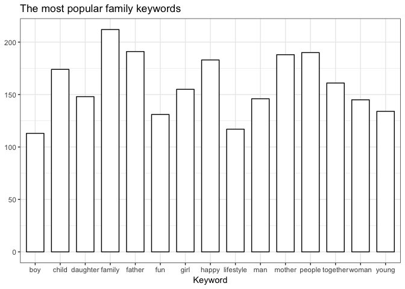

<!-- README.md is generated from README.Rmd. Please edit that file -->

# shutterstock

[](https://travis-ci.org/strboul/shutterstock-r)
[](https://cran.r-project.org/package=shutterstock)
[](https://www.r-pkg.org/pkg/shutterstock)
[](https://codecov.io/github/strboul/shutterstock-r?branch=master)

R package for Shutterstock REST API. Please refer to the official
reference [here](https://api-reference.shutterstock.com/).

## Installation

<!--You can install the released version of shutterstock from
[CRAN](https://CRAN.R-project.org) with:
``` r
install.packages("shutterstock")
```-->

You can install development version:

``` r
# install.packages("devtools")
devtools::install_github("strboul/shutterstock")
```

## Usage

Search the most popular images about *Amsterdam*:

``` r
library("shutterstock")
amsterdam <- searchImages(query = "Amsterdam", sort = "popular")
d <- amsterdam[["data"]]
do.call(rbind, lapply(d, function(x) {
  data.frame(
    id = x[["id"]],
    description = paste(strtrim(x[["description"]], 35L), "..."), # truncate description field
    preview = x[["assets"]][["preview"]][["url"]],
    stringsAsFactors = FALSE
  )
})) -> popular
head(popular)
##           id                             description
## 1  656151523 Amsterdam Netherlands dancing house ...
## 2  534783616 Amsterdam canal Singel with typical ...
## 3 1012458397 Amsterdam Netherlands, city skyline ...
## 4  797232592 Bike over canal Amsterdam city. Pic ...
## 5  642423370 Amsterdam Netherlands dancing house ...
## 6 1028628301 Channel in Amsterdam Netherlands ho ...
##                                                                                                                                                                                              preview
## 1        https://image.shutterstock.com/display_pic_with_logo/147241/656151523/stock-photo-amsterdam-netherlands-dancing-houses-over-river-amstel-landmark-in-old-european-city-spring-656151523.jpg
## 2   https://image.shutterstock.com/display_pic_with_logo/697543/534783616/stock-photo-amsterdam-canal-singel-with-typical-dutch-houses-and-houseboats-during-morning-blue-hour-holland-534783616.jpg
## 3                 https://image.shutterstock.com/display_pic_with_logo/1005848/1012458397/stock-photo-amsterdam-netherlands-city-skyline-at-canal-waterfront-with-spring-tulip-flower-1012458397.jpg
## 4 https://image.shutterstock.com/display_pic_with_logo/147241/797232592/stock-photo-bike-over-canal-amsterdam-city-picturesque-town-landscape-in-netherlands-with-view-on-river-amstel-797232592.jpg
## 5        https://image.shutterstock.com/display_pic_with_logo/147241/642423370/stock-photo-amsterdam-netherlands-dancing-houses-over-river-amstel-landmark-in-old-european-city-spring-642423370.jpg
## 6 https://image.shutterstock.com/display_pic_with_logo/147241/1028628301/stock-photo-channel-in-amsterdam-netherlands-houses-river-amstel-landmark-old-european-city-spring-landscape-1028628301.jpg
```

Build a frequency plot from keywords of the images searched with a
*family* query:

``` r
library("ggplot2")

images <- searchImages(query = "family", per_page = 225)
# extract image ids:
image.ids <- sapply(seq_along(images[["data"]]), function(i) {
  images[["data"]][[i]][["id"]]
})

data <- lapply(image.ids, function(x) {
  cat(sprintf("[%s] get image: \"%s\"", match(x, image.ids), x), sep = "\n")
  Sys.sleep(4) # try to prevent HTTP 429 error
  details <- getImageDetails(id = x)
  as.character(details[["keywords"]])
})

kws <- do.call(c, data)
tbl.counts <- as.data.frame(table(kws))
top.tbl <- tbl.counts[order(tbl.counts["Freq"], decreasing = TRUE), ]
top <- head(top.tbl, 15L)

ggplot(top, aes(x = kws, y = Freq)) +
  geom_bar(stat = "identity", width = 0.7, color = "black", fill = "white") +
  labs(title = "The most popular family keywords", x = "Keyword") +
  ylab(NULL) +
  theme_bw()
```



## OAuth 2.0 Authentication

OAuth 2.0 authentication is better to use for the queries as its scope
is greater than the capabilities of the basic authentication. Read the
vignette for more information. For general OAuth problems, please read
the [Shutterstock OAuth 2.0
guide](https://api-reference.shutterstock.com/#authentication-oauth-authentication-h2)
thoroughly.

## Development

PRs are welcomed\!

Only `GET` methods are supported in the current version.

See `?shutterstock` package documentation for more information.

Please note that the ‘shutterstock’ project is released with a
[Contributor Code of Conduct](CODE_OF_CONDUCT.md). By contributing to
this project, you agree to abide by its terms.
